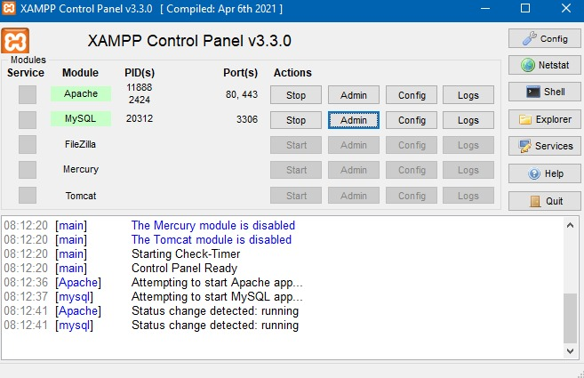

# Meu Projeto React Native com Node.js e XAMPP (phpMyAdmin)

Este projeto utiliza **React Native** para o front-end, **Node.js** como back-end e **phpMyAdmin (MySQL)** para o banco de dados. O objetivo deste README é fornecer instruções claras para configurar e rodar o projeto localmente.

---

## 🛠 Pré-requisitos

Certifique-se de ter os seguintes softwares instalados em sua máquina:

1. **Node.js** (v16 ou superior) - [Baixar Node.js](https://nodejs.org/)
2. **React Native CLI** (opcional caso prefira o Expo) - [Guia de instalação](https://reactnative.dev/docs/environment-setup)
3. **XAMPP** (com phpMyAdmin para gerenciar MySQL) - [Baixar XAMPP](https://www.apachefriends.org/)
5. **Git** (opcional) - [Baixar Git](https://git-scm.com/)

---

## ⚙️ Configuração do Ambiente

### 1. Banco de Dados com XAMPP
1. Abra o **XAMPP Control Panel** e inicie os serviços:
   - **Apache**
   - **MySQL**

   

2. Acesse o phpMyAdmin:
   - Abra o navegador e vá para `http://localhost/phpmyadmin`.

3. Crie um novo banco de dados:
   - Nomeie o banco de dados, por exemplo, `databasedb`.
   - Importe ou configure as tabelas usando esse arquivo: [orderlydb.sql](./frontend/src/sql/orderlydb.sql)

### 2. Back-End (Node.js)
1. Navegue até a pasta do projeto:
   ```bash
   cd backend
   ```

2. Instale as dependências:
   ```bash
   npm install
   ```

3. Configure o arquivo `server.js`:
   - Crie um arquivo `server.js` na raiz do back-end com as seguintes variáveis:
     ```env
     host: "localhost",
     user: "root",
     password: "",
     database: "orderlydb"
     ```

4. Inicie o servidor:
   ```bash
   npm start
   ```

#### Pronto! Seu banco de login esta funcionando!

---

### 3. Front-End (React Native)
1. Navegue até a pasta do projeto:
   ```bash
   cd frontend
   ```

2. Instale as dependências:
   ```bash
   npm install
   ```
3. Abra um terminal no VSCODE e inicie o site usando:
   ```bash
   cd frontend
   npm start
   ```
4. Abra outro terminal e inicie a nossa API local usando:
   ```bash
   cd frontend
   npm run server
   ```
---

## 🧪 Testando o Projeto

1. Certifique-se de que o back-end e o XAMPP estão rodando.
2. Abra o site com navegador `http://localhost/3000`.
3. Realize interações no app e verifique se os dados estão sendo salvos ou carregados corretamente no banco de dados MySQL.

---

## 👤 Entrando como Administrador

1. Abra a pagina de login clicando no icone de usuario no cabeçalho.
2. Por padrão o site abre como administrador, se quiser abrir a pagina de edição use `http://localhost/3000/admin`.
3. Use o email `admin@ex.com.br` e a senha `admin`.
4. Agora você pode criar, editar e deletar produtos e categorias.

---

## 📂 Estrutura do Projeto

```plaintext
orderlydb/
├── backend/
│   └── server.js          # Arquivo principal do servidor Node.js
├── frontend/
│   ├── src/
│   │   ├── components/    # Componentes React Native
│   │   ├── routes/        # Rotas do aplicativo
│   │   └── index.js       # Arquivo principal
│   └── package.json       # Dependências do front-end
└── README.md              # Este arquivo
```

---

## 📚 Referências e Links Úteis

- [React Native Documentation](https://reactnative.dev/docs/getting-started)
- [Node.js Documentation](https://nodejs.org/en/docs/)
- [XAMPP Documentation](https://www.apachefriends.org/docs.html)
- [phpMyAdmin Documentation](https://docs.phpmyadmin.net/)

---